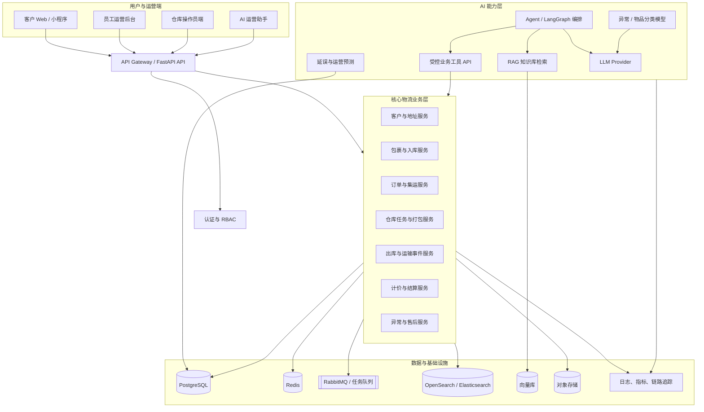

# TMS 企业级 AI 扩展架构路线图

本文将当前 TMS MVP 与课程文章中提到的“传统物流系统 + AI 应用 + Agent + 工程化”框架对应起来。

文档中的“当前”表示仓库中已经存在并可从代码确认的能力；“目标”表示后续可以逐步实现的扩展，不应直接当作已经完成的简历成果。

## 1. 项目定位

当前项目不是从零开始的物流聊天机器人，而是一个已经具备核心履约流程的集运仓库运营系统：

```text
包裹入库 → 到仓确认 → 集运申请 → 订单生成 → 仓库打包
        → 重量确认 → 出库确认 → 基础计价
```

继续发展后，可以成为：

> 面向集运与仓库履约场景的 AI-enhanced Transportation Management System，使用确定性业务服务保障订单、计价和状态流转，并使用 AI 完成自然语言理解、异常分类、运营查询和辅助预测。

这里的关键不是让大模型接管物流业务，而是：

```text
AI：理解、分类、检索、推荐、预测
程序：校验、计算、持久化、授权、执行
```

## 2. 总体目标架构



## 3. 当前代码对应的位置

| 目标层 | 当前实现 | 当前状态 |
|---|---|---|
| 客户端 | Vue 3、Vite、Pinia、Vue Router | 已有客户、员工、操作员页面 |
| API 层 | FastAPI 单体接口 | 已有 REST API |
| 认证 | PBKDF2 + HMAC Token + 后端 RBAC | 已实现基础能力 |
| 客户/包裹 | `customers`、`parcels` | 已有创建、查询、到仓状态 |
| 订单 | `orders` | 已有集运订单，但包裹关系仍是 JSON ID 列表 |
| 仓库 | `tasks` | 已有一订单一打包任务 |
| 通知 | `notifications` | 已有数据库通知，不是消息队列 |
| 计价 | Python 价格公式 | 已有基础计算和人工覆盖 |
| 数据库 | SQLite | 适合 MVP，不适合作为最终生产方案 |
| 文件 | `/tmp/tms_uploads` | 仅为演示上传，尚无文件元数据和访问控制 |
| AI | 无 | 后续新增，不应在当前简历中宣称已完成 |

## 4. 推荐的目标技术栈

### 4.1 前端

- Vue 3 + Vite
- Pinia：认证、用户和页面状态
- Vue Router：角色路由
- Tailwind CSS 或现有 CSS 体系
- ECharts：运营指标和延误分析
- PWA 或移动端适配：操作员和司机使用

### 4.2 核心后端

建议继续使用 Python，不需要为了模仿课程而重写成 Java：

- FastAPI：REST API、RBAC、OpenAPI
- Pydantic：请求和响应校验
- SQLAlchemy 或 SQLModel：数据库访问
- Alembic：数据库迁移
- PostgreSQL：生产关系数据
- Redis：缓存、幂等键、短期任务状态
- RabbitMQ 或 Celery：异步通知、文件处理、模型任务

### 4.3 AI 服务

- FastAPI：独立 AI 服务或当前服务中的独立模块
- LangChain：模型和工具适配
- LangGraph：多步骤 Agent 工作流
- Structured Output / JSON Schema：约束模型输出
- Embedding + pgvector 或向量数据库：规则与知识检索
- BERT/Transformer：稳定的物品和异常分类
- XGBoost：数据量足够后的延误/风险预测

### 4.4 工程化

- Docker Compose：本地 PostgreSQL、Redis、RabbitMQ、对象存储
- GitHub Actions 或其他 CI：测试、构建、镜像检查
- OpenTelemetry：请求和跨服务链路
- Prometheus + Grafana：指标监控
- Sentry 或统一日志系统：异常追踪
- MinIO/S3：包裹图片、装箱照片和凭证

不建议一次性引入所有组件。PostgreSQL、Redis、对象存储和一个消息队列足够支撑第一轮扩展。

## 5. 业务模块扩展

### 5.1 客户与包裹

页面：

- 客户列表、客户详情、地址簿
- 包裹创建、包裹详情、图片预览
- 到仓确认、包裹异常、包裹历史

数据：

```text
customers
addresses
parcels
parcel_files
parcel_events
```

解决的问题：包裹来源不清、图片凭证无法追踪、包裹状态依赖人工沟通。

### 5.2 订单与集运

页面：

- 集运申请
- 订单详情
- 包裹选择和重新分配
- 订单取消、拆单、合单

数据：

```text
orders
order_parcels
consignees
order_status_history
```

解决的问题：当前 `parcel_ids` JSON 不利于拆单、合单、释放和审计。

### 5.3 仓库作业

页面：

- 待办任务
- 我的任务
- 扫码入库
- 打包记录
- 装箱照片
- 异常上报

数据：

```text
warehouse_tasks
packing_records
packing_items
warehouse_exceptions
```

解决的问题：让“订单已进入仓库”进一步变成可分配、可追踪、可复核的作业流程。

### 5.4 出库与运输

页面：

- 出库单
- 承运商/渠道选择
- 转运单号
- 物流轨迹
- 异常运输

数据：

```text
shipments
shipment_events
carriers
service_routes
```

解决的问题：把当前的“发货完成”扩展为真正的出库、运输中、派送和签收状态。

### 5.5 计价与售后

页面：

- 价格规则
- 计价明细
- 账单
- 付款状态
- 改价审批
- 退款/理赔

数据：

```text
pricing_rules
billing_records
payment_records
refunds
claims
audit_logs
```

解决的问题：让价格从一个公式变成可解释、可追溯、可审批的业务记录。

## 6. AI 功能如何接入当前系统

### 第一项：异常分类助手

用户或员工输入：

> 包裹外箱破损，里面有液体流出。

AI 输出结构化结果：

```json
{
  "exception_type": "DAMAGED_PACKAGE",
  "severity": "HIGH",
  "needs_manual_review": true,
  "recommended_actions": ["拍照留证", "暂缓出库", "通知客服"]
}
```

系统随后由确定性规则决定是否创建异常记录、冻结订单或通知员工。

### 第二项：物流运营助手

Agent 可以调用的工具：


- `get_order(order_id)`
- `list_parcels(customer_id, status)`
- `get_shipment_events(shipment_id)`
- `list_pending_tasks()`
- `create_exception(order_id, type, description)`
- `calculate_price(weight, route, service)`

Agent 不直接改数据库，而是调用带 RBAC、参数校验和审计日志的后端 API。

### 第三项：自然语言查价

```text
用户自然语言
    ↓
LLM 提取地点、重量、体积、物品类型和服务类型
    ↓
Pydantic / 业务规则校验
    ↓
确定性计价服务
    ↓
返回价格、计价明细和限制条件
```

### 第四项：延误预测

只有积累了足够的 `shipment_events` 后再做：

```text
历史运输事件 + 网点处理量 + 路线 + 节假日
                    ↓
              XGBoost 预测
                    ↓
     延误概率 + 主要影响因素 + 运营建议
```

## 7. 推荐实施阶段

### Phase 0：修复当前 MVP

- 对齐前后端权限。
- 补齐价格、重量和权限测试。
- 修正订单列表与详情页的错误操作按钮。
- 建立可重复的 Python/Node 验证环境。

### Phase 1：完成可靠的 TMS 核心

- PostgreSQL + Alembic。
- `order_parcels` 关系表。
- 订单取消和异常状态。
- shipment 与 shipment events。
- 结算明细和改价审计。
- 对象存储和文件元数据。

### Phase 2：仓库运营工程化

- 任务分配。
- 扫码入库和出库。
- 打包照片与异常上报。
- RabbitMQ/Celery 异步任务。
- 运营报表和审计日志。

### Phase 3：加入可验证的 AI

- 异常分类模型或 LLM 分类器。
- 物流知识库 RAG。
- 只读运营助手。
- 受控工具调用和 AI 调用审计。

### Phase 4：预测和优化

- 延误预测。
- 网点处理能力预测。
- 取件/运输路线优化。
- 预测结果与人工反馈闭环。

## 8. 简历表述边界

### 当前可以写

> Built a full-stack TMS MVP with Vue 3, FastAPI and SQLite, implementing parcel intake, parcel consolidation, warehouse packing tasks, role-based access control, workflow state transitions and weight-based settlement.

### 完成 Phase 1 后可以写

> Extended the TMS with normalized order–parcel relationships, shipment event tracking, exception workflows, auditable billing records and PostgreSQL-backed persistence.

### 完成 Phase 3 后可以写

> Integrated a controlled AI operations assistant for logistics exception classification and order/parcel retrieval, using structured outputs, tool-level authorization, RAG-based policy lookup and auditable LLM interactions.

### 不应提前写

- 20+ 微服务
- 已上线 Agent 平台
- 已完成延误预测
- 已接入真实承运商
- 生产级 AI 物流平台
- 提升了某个没有评估数据支持的业务指标

## 9. 最终项目结构建议

```text
TMS/
├── frontend/                  # Vue 3 运营端和客户端
├── backend/                   # FastAPI 核心业务 API
│   ├── routes/                # HTTP 接口
│   ├── services/              # 订单、包裹、仓库、运输、计价
│   ├── models/                # ORM 模型
│   ├── schemas/               # Pydantic DTO
│   ├── auth/                  # Token、RBAC、审计
│   └── migrations/            # Alembic
├── ai_service/                # Agent、RAG、分类、预测
│   ├── agents/
│   ├── tools/
│   ├── retrieval/
│   ├── classifiers/
│   └── evaluation/
├── infra/                     # Docker、消息队列、监控
├── docs/                      # API、状态机、架构和决策记录
└── tests/                     # 单元、接口和业务流程测试
```

这条路线能把当前项目从“集运仓库 MVP”自然扩展为“有真实业务闭环、可接入 AI、且简历表述有证据支撑的 AI-enabled TMS”，但每一阶段都应在代码、测试和运行结果完成后再写入简历。
