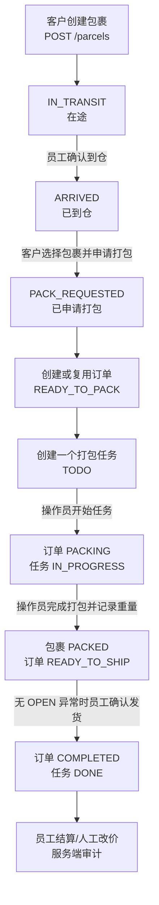
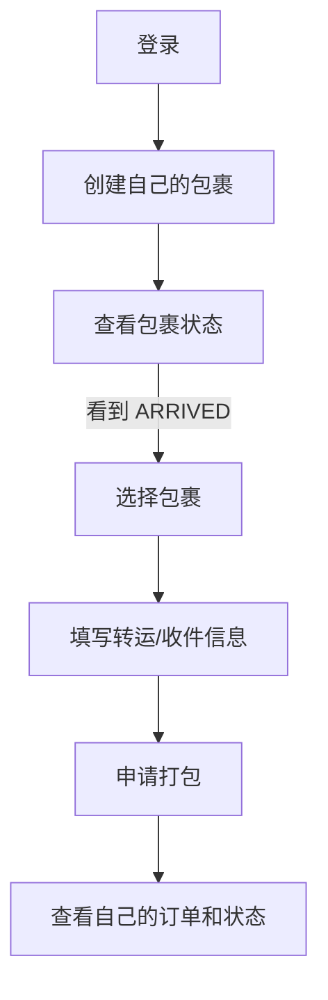
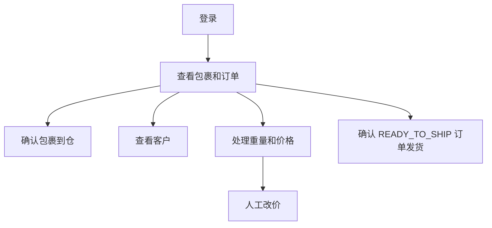
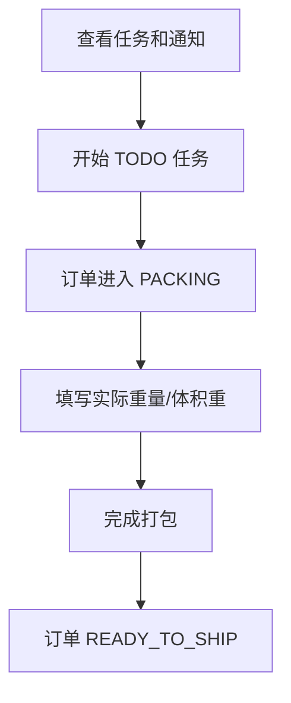
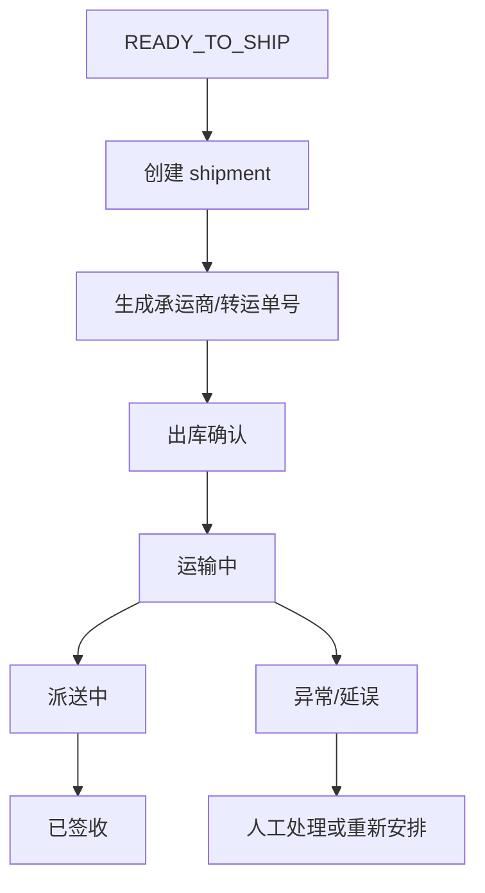
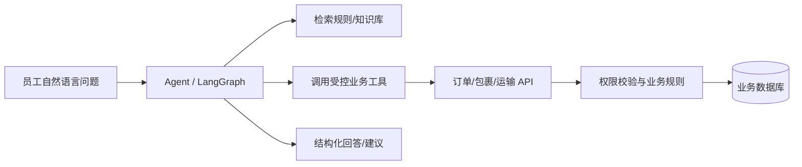

# TMS 流程说明

本文区分“当前代码已实现的 MVP 流程”和“后续目标流程”。当前状态机以 `backend/main.py` 为准；目标状态不能当作现有功能或简历成果。

## 1. 当前项目定位

当前项目是一个集运仓库运营 TMS，核心目标是把客户、仓库操作员和员工之间的人工交接记录下来：

```text
客户提交包裹 → 员工确认到仓 → 客户申请打包 → 生成订单和任务
→ 操作员打包 → 员工确认发货 → 基础计价或人工改价
```

当前项目不是完整承运商平台，也没有 AI、付款、真实物流轨迹或生产级运输调度。

## 2. 当前主流程



注意：当前发货接口会把订单标记为 `COMPLETED`，包裹状态保持 `PACKED`，只记录 `shipped_at`。这不是完整的运输和签收状态。

## 3. 角色流程

### 3.1 客户 `customer`



### 3.2 员工 `staff`



### 3.3 仓库操作员 `operator`



## 4. 当前状态机

### 4.1 包裹

```text
IN_TRANSIT → ARRIVED → PACK_REQUESTED → PACKED
```

代码中还定义了 `SUBMITTED` 和 `REJECTED`，但当前创建包裹接口直接使用 `IN_TRANSIT`，后续也没有完整的拒收流程。

### 4.2 订单

```text
DRAFT → READY_TO_PACK → PACKING → READY_TO_SHIP → COMPLETED
```

自动申请打包时通常直接生成 `READY_TO_PACK` 订单。订单完成打包后进入 `READY_TO_SHIP`；发货接口再将订单置为 `COMPLETED`。

### 4.3 任务

```text
TODO → IN_PROGRESS → DONE
```

当前完成打包时任务暂时仍保持 `IN_PROGRESS`，等员工发货时才变成 `DONE`。这是当前实现的简化设计，后续可以拆分“打包任务完成”和“出库任务完成”。

## 5. 当前页面对应的流程动作

| 页面 | 当前已实现的主要动作 |
|---|---|
| `/upload` | 创建包裹、上传图片 |
| `/parcels` | 查询包裹、员工标记到仓、客户申请打包、查看通知 |
| `/orders` | 查询订单、筛选、进入详情、部分任务/发货动作 |
| `/orders/:id` | 查看订单、记录重量、完成打包、员工发货 |
| `/tasks` | 查看任务、操作员开始任务 |
| `/billing` | 计算价格、人工覆盖价格 |
| `/exceptions` | 登记、查看和解决订单异常 |
| `/customers` | 员工查看客户 |
| `/customers/:id` | 员工查看客户关联订单 |

重量、价格、异常和发货均由后端按角色、订单状态和未解决异常进行最终校验。

## 6. 当前异常与结算审计

```text
客户：取消 / 地址错误 / 价格争议
员工：全部异常类型，并负责 OPEN -> RESOLVED
操作员：破损 / 违禁品
```

`OPEN` 异常不会改变订单状态，但会阻止发货、自动计价和人工改价。操作员只能在 `PACKING` 更新重量；员工可在 `PACKING` 或 `READY_TO_SHIP` 修正重量；`COMPLETED` 后重量不可再改。价格操作仅限员工且仅限 `COMPLETED` 订单。所有异常、重量和价格变更都写入服务端审计记录。

## 7. 目标扩展流程

### 7.1 订单和包裹关系

当前 `orders.parcel_ids` 是 JSON 列表。目标是使用 `order_parcels` 关系表，从而支持：

```text
包裹入库 → 可选包裹池 → 加入订单 → 订单拆分/合并 → 出库
                         ↘ 释放/重新分配
```

### 7.2 出库和运输事件



目标新增 `shipments`、`shipment_events`、`exceptions` 等模型后，订单完成和包裹签收才可以被准确区分。

### 7.3 AI 运营助手



AI 只负责理解、分类、检索和推荐；订单变更、价格计算、状态流转仍由后端业务服务执行。

## 8. 推荐演进顺序

1. 修复前后端权限和按钮错位。
2. 补齐价格、重量和权限测试。
3. 用 `order_parcels` 替代 JSON 包裹列表。
4. 增加订单取消、异常和售后记录。
5. 增加 shipment 与运输事件。
6. 增加任务分配、装箱记录和异常上报。
7. 实现异常分类或只读运营助手。
8. 有足够运输事件数据后再做延误预测。

长期目标架构见 [ARCHITECTURE_ROADMAP.md](ARCHITECTURE_ROADMAP.md)。
