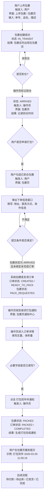
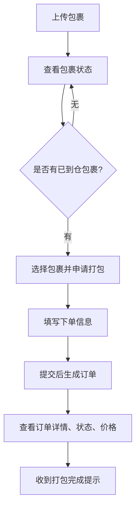
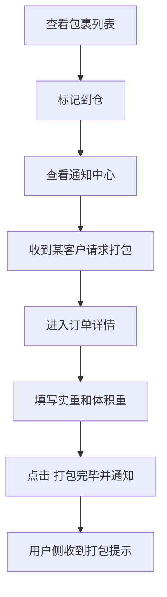
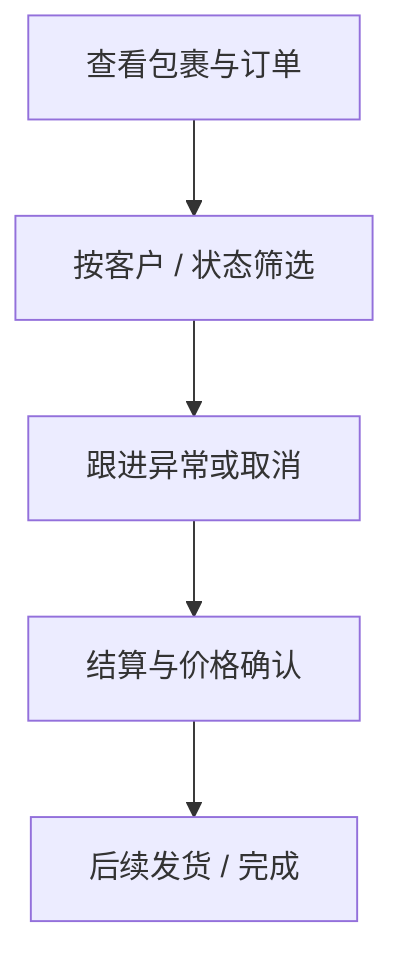

# TMS 流程说明

本文件根据 [流程.docx](/home/scottsux/TMS/流程.docx) 整理而成，目标是把原始文字描述转换成结构化流程说明与流程图。

说明：

- 本文优先保留原文表达的业务意图
- 原文中包含“当前实现”和“后续规划”两类内容，已在文中区分
- 当前代码实际状态机仍应以 `backend/main.py` 为准

## 1. 流程概览

业务主链路如下：

1. 用户购买商品或寄送包裹
2. 用户上传包裹信息
3. 包裹进入在途状态，并在包裹页面实时显示
4. 操作员在包裹页面确认到仓
5. 用户选择一批已到仓包裹并申请打包
6. 系统创建订单并写入下单信息
7. 操作员在订单详情中填写重量并完成打包
8. 用户收到打包完成提示
9. 后续可进入结算、入库、发货、完成等后续阶段

## 2. 主流程图

## 3. 角色视角流程

### 3.1 用户视角

### 3.2 操作员视角

### 3.3 员工视角

## 4. 包裹状态流转

以下内容来自原始文档，分为“当前主流程状态”和“规划扩展状态”。

### 4.1 当前主流程状态

| 状态 | 含义 |
| --- | --- |
| `IN_TRANSIT` | 在途 |
| `ARRIVED` | 已到仓 |
| `PACK_REQUESTED` | 已申请打包 |
| `PACKED` | 已打包 |

### 4.2 规划扩展状态

| 状态 | 含义 |
| --- | --- |
| `STORED` | 已入库 / 待发出 |
| `SHIPPED` | 已发货 |
| `CANCELLED` | 已取消 |
| `EXCEPTION` | 异常 |

### 4.3 包裹状态流转表

| 阶段 | 流转 | 触发人 | 界面 | 触发条件 | 结果 |
| --- | --- | --- | --- | --- | --- |
| 初始创建 | `(无) -> IN_TRANSIT` | 用户 | 上传包裹 / 包裹页 | 填写单号、品名、描述 | 创建包裹，进入在途 |
| 到仓确认 | `IN_TRANSIT -> ARRIVED` | 操作员 | 包裹页 | 包裹存在 | 标记已到仓，记录时间 |
| 用户申请打包 | `ARRIVED -> PACK_REQUESTED` | 用户 | 包裹页 | 包裹为 `ARRIVED` 且未绑定未完成订单 | 创建订单，记录申请时间 |
| 打包完成 | `PACK_REQUESTED / PACKING -> PACKED` | 操作员 | 订单详情页 | 已填写必要字段 | 包裹完成打包，生成通知 |
| 发货 | `PACKED -> SHIPPED` | 员工 / 操作员 | 订单页 | 已填写物流信息 | 记录发货时间 |
| 异常处理 | `任意状态 -> EXCEPTION` | 员工 | 包裹页 | 发现异常 | 标记异常并填写原因 |
| 取消 | `IN_TRANSIT / ARRIVED -> CANCELLED` | 用户 / 员工 | 包裹页 | 未进入打包流程 | 包裹取消 |

## 5. 订单状态流转

### 5.1 当前主流程状态

| 状态 | 含义 |
| --- | --- |
| `CREATED` | 已创建 |
| `PACKING` | 打包中 |
| `PACKED` | 已打包完成 |

### 5.2 规划扩展状态

| 状态 | 含义 |
| --- | --- |
| `PENDING_PACK` | 等待打包 |
| `WAITING_PAYMENT` | 待付款 |
| `READY_TO_SHIP` | 待出库 |
| `SHIPPED` | 已发货 |
| `COMPLETED` | 已完成 |
| `CANCELLED` | 已取消 |

### 5.3 订单状态流转表

| 阶段 | 流转 | 触发人 | 界面 | 触发条件 | 结果 |
| --- | --- | --- | --- | --- | --- |
| 创建订单 | `(无) -> CREATED` | 系统 | 包裹页 | 用户提交打包申请 | 自动创建订单 |
| 等待打包 | `CREATED -> PENDING_PACK` | 系统 | 系统逻辑 | 订单已生成 | 等待操作员处理 |
| 开始打包 | `CREATED / PENDING_PACK -> PACKING` | 操作员 | 订单详情页 | 订单已进入处理阶段 | 订单进入打包中 |
| 打包完成 | `PACKING -> PACKED` | 操作员 | 订单详情页 | 点击打包完毕并通知 | 更新订单状态 |
| 待付款 | `PACKED -> WAITING_PAYMENT` | 系统 | 系统逻辑 | 需要用户付款 | 进入待付款 |
| 待发货 | `PACKED / WAITING_PAYMENT -> READY_TO_SHIP` | 系统 / 员工 | 系统逻辑 | 费用确认完成 | 进入待发货 |
| 已发货 | `READY_TO_SHIP -> SHIPPED` | 员工 / 操作员 | 订单页 | 已填写物流单号 | 更新为已发货 |
| 完成 | `SHIPPED -> COMPLETED` | 系统 / 员工 | 系统逻辑 | 确认送达 | 完成闭环 |
| 取消 | `CREATED / PENDING_PACK -> CANCELLED` | 用户 / 员工 | 订单页 | 未开始打包 | 订单取消 |

## 6. 关键触发条件

### 6.1 用户申请打包

触发条件：

- 包裹状态必须为 `ARRIVED`
- 包裹不能绑定到未完成订单
- 用户需填写完整收件信息

结果：

- 创建或复用订单
- 包裹状态改为 `PACK_REQUESTED`
- 订单页面出现新订单
- 操作员收到通知

### 6.2 操作员完成打包

触发条件：

- 已进入订单详情
- 已填写实际重量和体积重量
- 点击“打包完毕并通知”

结果：

- 包裹状态更新为 `PACKED`
- 订单状态更新为已打包完成
- 用户侧显示打包完成提示

### 6.3 发货

触发条件：

- 已完成打包
- 已填写物流单号

结果：

- 包裹 / 订单状态进入发货阶段
- 记录发货时间

## 7. 各界面涉及的流程动作

### 7.1 包裹界面

用户：

- 搜索运单号
- 按状态筛选
- 查看包裹表格
- 选择已到仓包裹
- 点击申请打包
- 填写下单信息
- 查看打包完成提示

操作员：

- 搜索运单号
- 按状态筛选
- 查看通知中心
- 刷新通知
- 清空通知
- 标记到仓

员工：

- 搜索运单号
- 按状态筛选
- 按客户筛选

### 7.2 订单页面

用户：

- 搜索下单时间 / 运单号
- 状态筛选
- 排序
- 查看自己的订单
- 进入订单详情

操作员：

- 搜索下单时间 / 运单号 / 客户名
- 状态筛选
- 排序
- 查看所有订单
- 进入订单详情
- 操作打包流程

员工：

- 当前可暂按操作员视角处理

### 7.3 订单详情页面

包含内容：

- 下单信息
- 客户信息
- 包裹栏
- 实际重量填写栏
- 体积重量计算栏
- 打包完毕并通知按钮

核心动作：

- 填写实重
- 填写长宽高并计算体积重
- 点击“打包完毕并通知”

## 8. 文档与当前实现差异说明

原始 `docx` 中提到了以下扩展状态：

- `STORED`
- `SHIPPED`
- `WAITING_PAYMENT`
- `READY_TO_SHIP`
- `COMPLETED`
- `CANCELLED`
- `EXCEPTION`

这些状态体现了更完整的仓储 / 结算 / 发货流程，但当前仓库实现并未完全覆盖。若要实现，应同步修改：

- `backend/main.py`
- `frontend/src/constants/enums.js`
- 相关列表页、详情页、筛选项和按钮逻辑
- `README.md`
